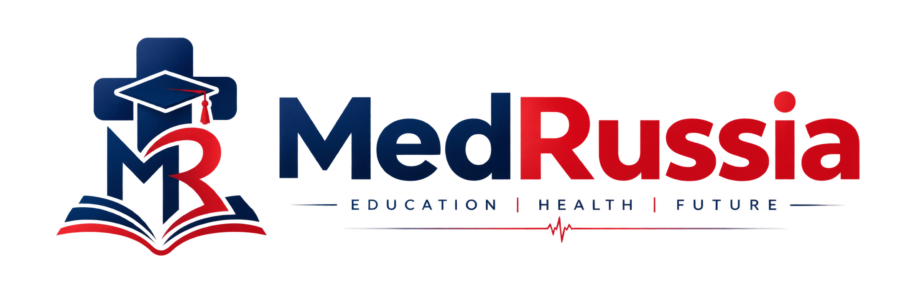

<div align="center">

  

  # MedRussia

  ### The Sovereign Digital Platform for Medical Education Abroad

  [](https://fastapi.tiangolo.com)
  [](https://react.dev)
  [](https://developer.android.com/jetpack/compose)
  [](https://www.postgresql.org)
  [](LICENSE)
  [](#development-status)

  <p align="center">
    <strong>Empowering medical aspirants with 100% NMC FMGL-compliant admissions, transparent 6-year multi-currency fee schedules, automated milestone dossier tracking, and AI-assisted academic counseling.</strong>
  </p>

  <p align="center">
    <a href="https://med-russia.vercel.app"><strong>🌐 Explore Live Web Prototype »</strong></a>
    <br />
    <em>Note: The live deployment is an active prototype; the production platform continues to evolve.</em>
  </p>

</div>

---

## 📌 Executive Summary

**MedRussia** is an end-to-end, multi-client medical admissions and university governance platform engineered to digitize, verify, and streamline international MBBS education in the Russian Federation for Indian students.

Navigating foreign medical education historically suffers from opaque agent markups, fragmented documentation, and high compliance risks relative to statutory mandates (such as India's **National Medical Commission (NMC) FMGL Regulations 2021**). MedRussia bridges this gap with a single source of truth: unified backend business logic, automated 5-stage admission tracking, tamper-evident private document vaults, and multi-currency financial planners.

> **Notice**: This public repository serves as the official architectural showcase, system documentation, and engineering portfolio. Production source code, environment secrets, and deployment keys are maintained within private enterprise repositories (`medrussia-platform 🔒`, `medrussia-android 🔒`, `MedRussia-web 🔒`).

---

## 📚 Documentation Index

Explore the comprehensive technical documentation organized by subsystem:

### 1. Global Platform Specifications
* [System Architecture Overview](docs/architecture.md) — Multi-tier design, API gateway pattern, response envelopes, and RFC 7807 error model.
* [Product Features & Compliance](docs/features.md) — University explorer, 6-year calculator, NMC eligibility engine, and KYC vault.
* [Technology Stack Matrix](docs/tech-stack.md) — Full breakdown of languages, frameworks, ORMs, and hosting tiers.
* [Project Roadmap & Milestones](docs/roadmap.md) — Past accomplishments, active tasks, and future horizons.
* [Security Philosophy & Data Protection](docs/security.md) — Defense-in-depth, token rotation, and private storage architecture.

### 2. Native Android Application Client
* [Android Client Overview](docs/android/README.md) — Jetpack Compose architecture, UI/UX philosophy, and setup guide.
* [Android Architecture Deep Dive](docs/android/architecture.md) — Unidirectional data flow (UDF), ViewModel state hoisting, and Ktor client.
* [Android Screen & Feature Breakdown](docs/android/features.md) — Cinematic onboarding, dashboard, 5-stage tracker, and document vault.
* [Android Dependencies & Tech Stack](docs/android/tech-stack.md) — Kotlin 1.9+, Java 21 toolchain, Compose BOM, and R8 shrinking.

### 3. Central Platform API (Backend)
* [Central Platform Overview](docs/platform/README.md) — FastAPI ASGI backend, domain services, and database persistence.
* [Backend Architecture & Service Design](docs/platform/architecture.md) — Non-blocking async pipeline, dependency injection, and state machines.
* [OpenAPI Specifications & Contracts](docs/platform/api-specifications.md) — Endpoint index, request/response envelopes, and problem details.
* [Platform Security & Storage Model](docs/platform/security-model.md) — Argon2-cffi, stateless JWT lifecycle, and ephemeral S3 presigning.

---

## 🎯 The Problem & Our Solution

### The Challenge
* **Opaque & Hidden Fee Structures**: Informal brokers frequently inflate tuition, hostel, and visa expenses with unpredictable forex fluctuations.
* **Statutory Non-Compliance Risks**: Students often matriculate into programs failing the NMC Foreign Medical Graduate Licentiate (FMGL) 2021 guidelines (minimum 54-month continuous English-medium curriculum + 12-month clinical clerkship).
* **Vulnerable Document Transmission**: Physical passports, NEET scorecards, and apostilled academic marksheets are handled via insecure, untracked channels.
* **Zero Admission Visibility**: Candidates wait months without real-time tracking for Russian Ministry of Internal Affairs (MVD) electronic visa invitations.

### The MedRussia Solution
* **Verified University Catalog**: Direct partnerships and catalog data across 40+ recognized Russian medical universities with verified medium of instruction and Indian hostel dining availability.
* **Deterministic 6-Year Budget Calculator**: Real-time conversion across INR, Russian Rubles (RUB), and USD with inflation and lifestyle parameters.
* **NMC FMGL 2021 Eligibility Evaluator**: Instant algorithmic validation of 12th PCB percentages, age eligibility, and NEET qualification cutoffs.
* **5-Stage Live Milestone Tracking**: Automated candidate lifecycle tracker from application submission to electronic study visa stamping and campus arrival.
* **Private Encrypted Document Vault**: Ephemeral, short-lived signed URLs for confidential KYC document transmission with zero public URL exposure.
* **24/7 AI MD Counselor & Human Desk**: Hybrid advising powered by Google Gemini AI alongside certified educational counselors.

---

## 🌐 Live Platform

The web client prototype is live and accessible at:
👉 **[https://med-russia.vercel.app](https://med-russia.vercel.app)**

> *Notice: It's an active working prototype; the final production product will include additional enterprise integrations and continuous security enhancements.*

---

## 🌟 Key Platform Features

| Feature | Category | Description |
| :--- | :--- | :--- |
| **University Explorer** | Discovery | Filter 40+ government medical universities by NMC recognition, budget, ranking, and Indian mess dining. |
| **6-Year Cost Planner** | Finance | Complete multi-currency fee estimator including tuition, standard/comfort hostels, food, and annual flights. |
| **AI Eligibility Checker** | Compliance | Instant NMC FMGL 2021 Gazette assessment based on caste category, 12th PCB marks, and NEET score. |
| **5-Stage Dossier Tracker** | Admissions | Step-by-step progress tracker covering Application, Admission Letter, MVD Ministry Invitation, Visa, and Enrollment. |
| **Student Document Vault** | Security & KYC | Secure document upload and private previewing via authenticated, ephemeral signed URLs. |
| **AI MD Counselor** | Advisory | 24/7 AI medical career advising engine providing immediate guidance on curriculum, licensing, and life in Russia. |
| **Counselor Desk** | Human Support | Direct channel to speak with senior academic coordinators for customized admission roadmaps. |

---

## 🏛️ High-Level System Architecture

MedRussia implements a decoupled, multi-tier architecture governed by a central, stateless backend authority.

```
                           +-------------------------------------+
                           |      Google Gemini AI Engine        |
                           +------------------+------------------+
                                              | (Advisory Proxy)
                                              v
+-----------------------+              +----------------------+              +----------------------+
|    MedRussia Web      |  HTTPS/REST  |  MedRussia Platform  |  Async SQL   |      PostgreSQL      |
| (React 19 / Vite SPA) +------------->+  FastAPI Central API +------------->+ (ACID Persistence &  |
+-----------------------+              |   (Business Core)    |              |  Relational Envelopes|
                                       +----------+-----------+              +----------------------+
+-----------------------+                         |
|   MedRussia Android   |       HTTPS/Ktor        | Presigned Signed URLs
| (Kotlin Compose MVVM) +-------------------------+ (15-min TTL)
+-----------------------+                         v
                                       +----------------------+
                                       | Private Storage (S3) |
                                       | (Encrypted KYC Vault)|
                                       +----------------------+
```

---

## 💻 Technology Stack Summary

### Backend
* **FastAPI (Python 3.11+)**: High-performance, asynchronous REST framework with native OpenAPI 3.1 generation.
* **Uvicorn**: Asynchronous Server Gateway Interface (ASGI) server running with `uvloop`.
* **SQLAlchemy 2.0 (Async)**: Declarative Object-Relational Mapper with fully non-blocking database queries.
* **Alembic**: Deterministic database schema versioning and automated migration scripts.
* **Pydantic v2**: High-throughput data validation and settings management.
* **PyJWT & Argon2-cffi**: Cryptographically hardened authentication with short-lived JWTs and salted password hashing.

### Web Client
* **React 19 / 18 & TypeScript 5.8+**: Modern, strictly typed component-driven client architecture.
* **Vite 6.2+**: Next-generation frontend tooling offering instant Hot Module Replacement (HMR).
* **Tailwind CSS v3**: Clean utility-first design system with responsive layouts and accessible color contrasts.
* **React Router v6**: Client-side declarative routing with authentication guards.
* **Recharts**: Responsive SVG financial charts and comparative fee calculators.

### Mobile Client (Android)
* **Kotlin 1.9+ & Java 21**: Modern expressive language tooling on Android SDK 35.
* **Jetpack Compose**: Declarative reactive UI framework utilizing Material Design 3.
* **Coroutines & Reactive StateFlow**: Non-blocking asynchronous threading with single-source-of-truth state holders.
* **Ktor HTTP Client**: Lightweight, multiplatform-ready networking engine.
* **Kotlinx Serialization**: Reflection-free, high-speed JSON serialization.

### Database & Storage
* **PostgreSQL 15+**: Relational integrity, foreign key cascades, and transactional consistency.
* **Private S3-Compatible Cloud Storage**: Private bucket architecture utilizing server-signed ephemeral URLs (15-minute expiration).

---

## 🌐 Project Ecosystem

MedRussia is partitioned into focused modules to maintain strict security boundaries and development velocity:

```
MedRussia Ecosystem
│
├── medrussia-platform 🔒
│   └── Private core backend repository (FastAPI, business logic, PostgreSQL migrations)
│
├── medrussia-android 🔒
│   └── Production Android application codebase (Jetpack Compose native client)
│
├── MedRussia-web 🔒
│   └── Production Web client codebase (React / Vite single-page application)
│
└── MedRussia-Documentation 🌍 (This Repository)
    └── Public portal, architectural documentation, product roadmaps, and developer showcases
```

---

## 📱 Interface Previews & Screenshots

<div align="center">

| Web Landing & Hero | Android Admission Tracker |
| :---: | :---: |
|  |  |
| *Desktop Explorer & Filter Matrix* | *5-Stage Real-Time Milestone Tracker* |

</div>

*Inspect the complete UI capture gallery in [screenshots/README.md](screenshots/README.md).*

---

## 🚦 Development Status & Roadmap

| Phase | Milestone | Status | Target |
| :---: | :--- | :---: | :---: |
| **Phase 1** | System Unification & Central FastAPI Platform Engine | Completed ✅ | Q1 2026 |
| **Phase 2** | RFC 7807 Standardized Errors & JWT Token Rotation | Completed ✅ | Q2 2026 |
| **Phase 3** | Private S3 Document Vault with Ephemeral Signed URLs | Completed ✅ | Q2 2026 |
| **Phase 4** | Web & Android Unified Client Cutover to Central API | Completed ✅ | Q3 2026 |
| **Phase 5** | Production Readiness & External Verification | In Progress 🔄 | Q3 2026 |
| **Phase 6** | Real-time WebSockets & Multi-language Localization | Planned 📅 | Q4 2026 |

---

## 🛡️ Security Philosophy

MedRussia adheres to strict security and privacy standards:
* **Private Production Codebase**: Production business logic and private keys are never exposed in public repositories.
* **Stateless JWT with Token Rotation**: Short-lived access tokens combined with secure refresh token rotation minimize interception vulnerabilities.
* **Zero Public Storage URLs**: KYC documents and medical records are stored in private cloud buckets, accessible only via temporary, authenticated presigned URLs.
* **Role-Based Access Control (RBAC)**: Strict role separation (`student`, `counselor`, `admin`, `superadmin`) enforced at the API gateway layer.
* **Auditability & Observability**: Every request is assigned a unique UUID correlation ID logged via structured JSON.

*Read our full security policy in [docs/security.md](docs/security.md).*

---

## 📄 License

This documentation repository is distributed under the **MIT License**. See [LICENSE](LICENSE) for details.

---

<div align="center">
  <sub>Built with precision for future medical leaders. © 2026 MedRussia Technologies. All rights reserved.</sub>
</div>
